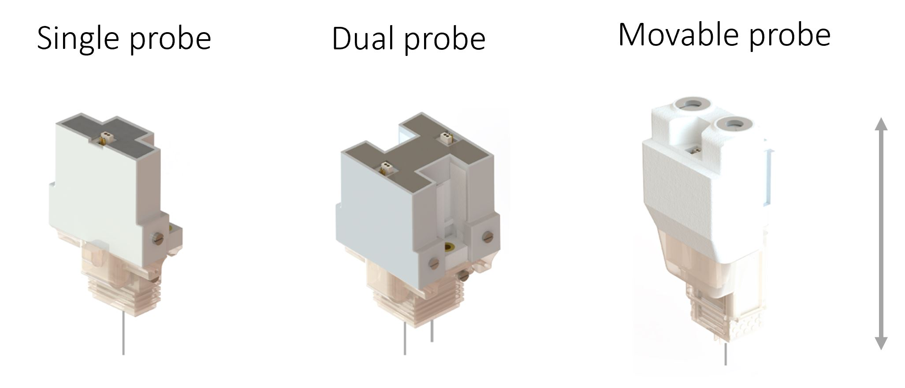

# chronic-neuropixels-protocol
(Chronic Neuropixels recordings in mice and rats; Rik van Daal , Cagatay Aydin , Frédéric Michon , Arno Aarts , Michael Kraft , Fabian Kloosterman, Nature Protocols; NP-P200042C, 2021 )



## Neuropixels chronic fixtures

Parts can be printed at [Materalize](https://www.materialise.com/en/manufacturing?gclid=Cj0KCQiA3smABhCjARIsAKtrg6KI-4CloUFmDMtG961YggM_I_BZ4re97FsboS6jPqCWgjePmS5XPqQaAv8xEALw_wcB)

### CAD files for 3D parts

- [Single probe fixture](https://github.com/nerf-common/chronic-neuropixels-protocol/blob/master/CAD_files/single_probe_fixture)
- [Dual probe fixture](https://github.com/nerf-common/chronic-neuropixels-protocol/blob/master/CAD_files/dual_probe_fixture)
- [Movable probe fixture](https://github.com/nerf-common/chronic-neuropixels-protocol/blob/master/CAD_files/movable_probe_fixture)
- [Adaptors for stereotaxic frame](https://github.com/nerf-common/chronic-neuropixels-protocol/blob/master/CAD_files/adaptor_parts) 

## Data and Code

### System requirements

__Operating system__: Windows Server 2012 R2 Standard

__Versions of the software__:MATLAB (R2020b), Python (3.7.7)

### Overview of data analysis steps

Raw data is filtered and sorted using adapted version of [ecephys_spike_sorting pipeline](https://github.com/jenniferColonell/ecephys_spike_sorting)


__Filtering__: [CatGT](https://billkarsh.github.io/SpikeGLX/#catgt) Version 1.2.6 is used with parameters given below

```python
catGT_cmd_string = '-prb_fld -out_prb_fld -aphipass=300 -aplopass=9000 -gbldmx -gfix=0.4,0.10,0.02'
```

__Sorting__: [Kilosort2](https://github.com/MouseLand/Kilosort) is used with default parameters

Number of good units are extracted by using custom written `update_cluster_group.m` function located in [code](https://github.com/nerf-common/chronic-neuropixels-protocol/blob/master/code)

```matlab
% amplitude_cutoff, presence_ratio, isi_viol are generated by using
% https://allensdk.readthedocs.io/en/latest/_static/examples/nb/ecephys_quality_metrics.html
idx = Tmetric.amplitude_cutoff<0.1&... 
    Tmetric.presence_ratio>0.95&...
    Tmetric.isi_viol<0.5&...
    ig; % index for Kilosort2 'good' label after noise removal
```	
__Spike statistics__:

Spike count, amplitude, RMS values are extracted from filtered data by using [neuropixels-evaluation-tools](https://github.com/jenniferColonell/Neuropixels_evaluation_tools) 

## Instructions for custom written code

1. Download and extract the [meta data](https://github.com/nerf-common/chronic-neuropixels-protocol/blob/master/data)


2.
	